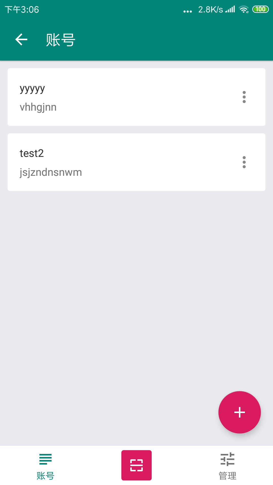
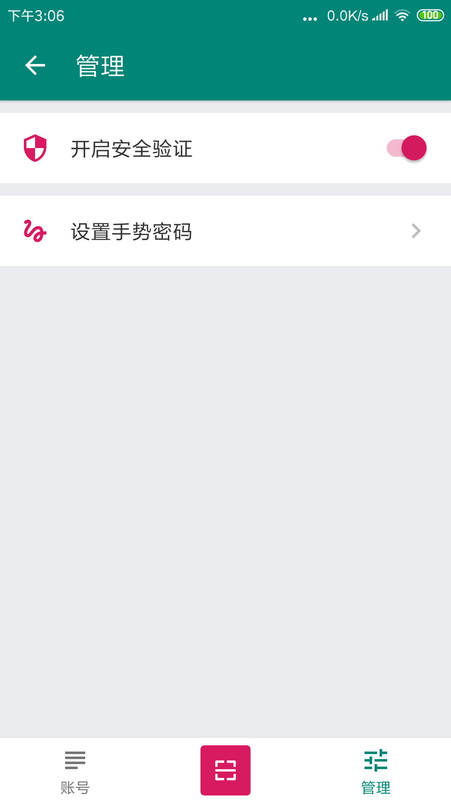
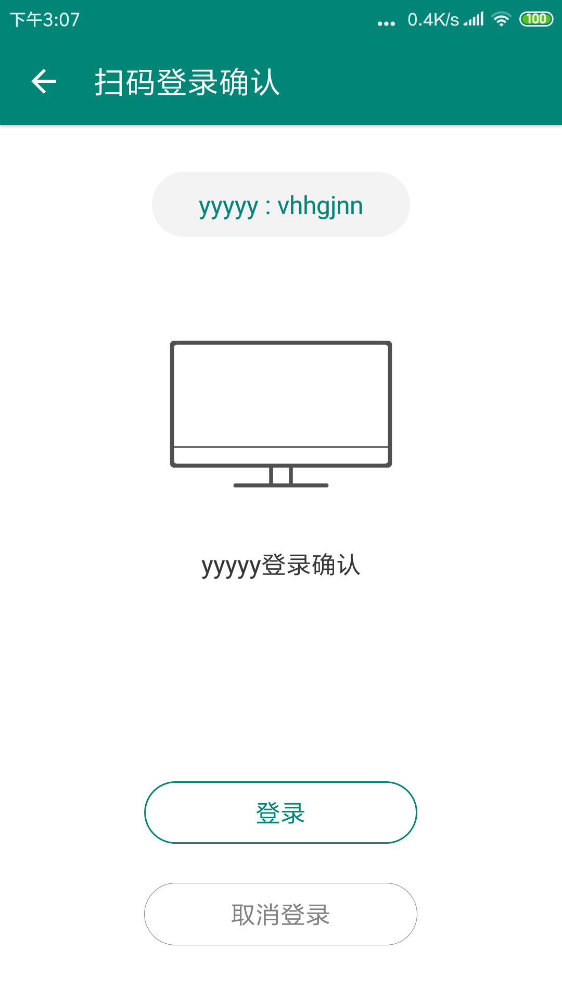
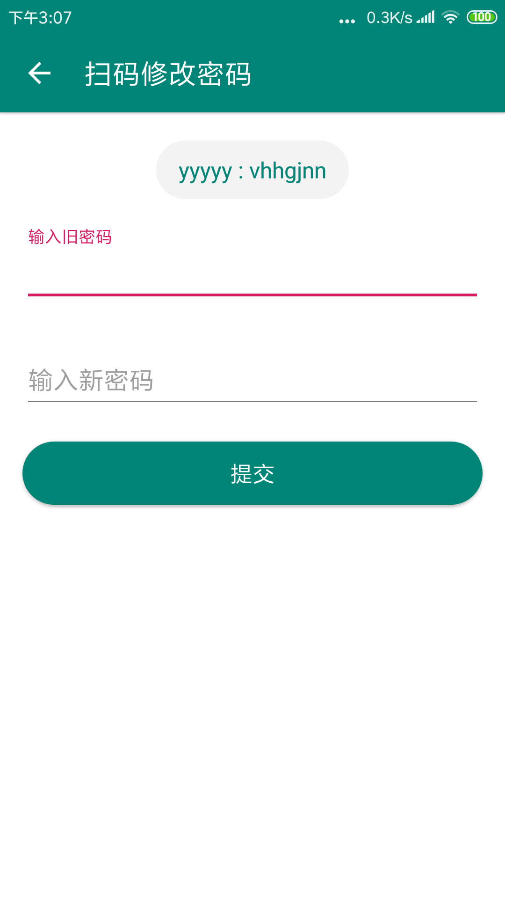
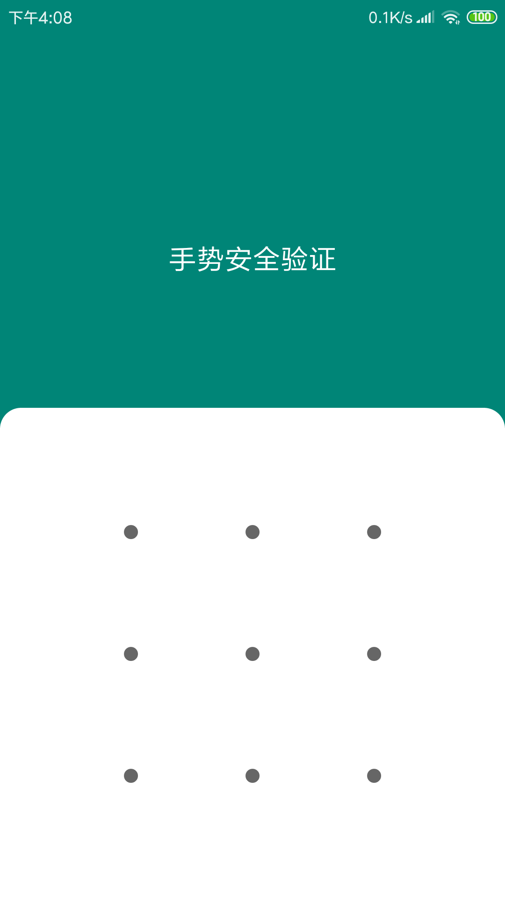
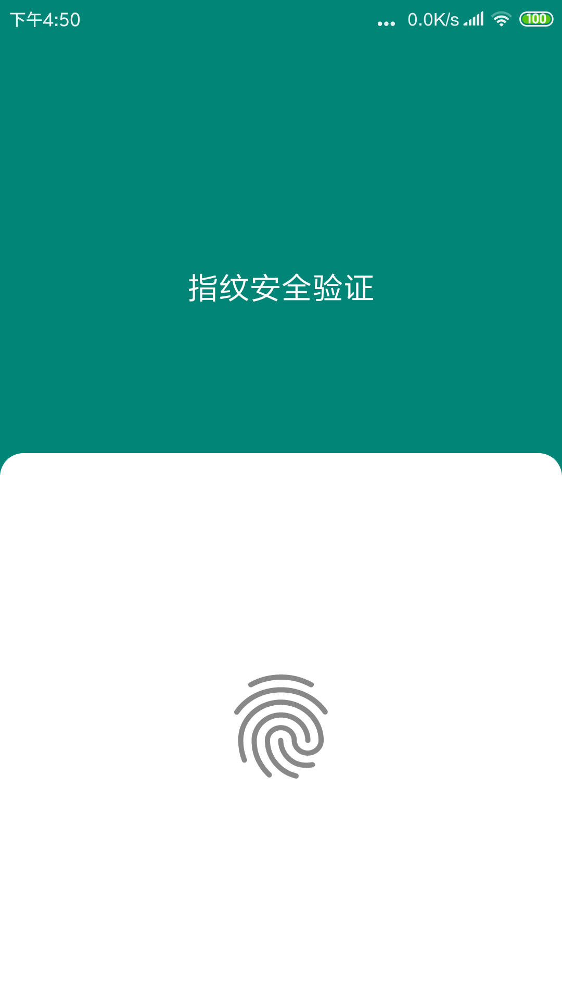

## 接入文档

- iOS端接入（暂无）

- [Android端接入](/docs/Android.md)

    - 提供独立的UI、加密存储、加密网络通信模块，方便快速集成。
    - 支持：账号添加、扫码登录、扫码修改密码、安全验证等功能。

- [SDK更新日志](/docs/Changes.md)

### 1、测试网址

- 扫码登录

```
http://39.105.135.105/pa/user/login
```

- 扫码修改密码

```
http://39.105.135.105/pa/user/modify
```

### 2、测试截图
#### 2.1、SDK主界面

<div align="left">


</div>

#### 2.2、SDK扫码相关

<div align="left">


</div>

#### 2.3、SDK安全验证

<div align="left">


</div>


